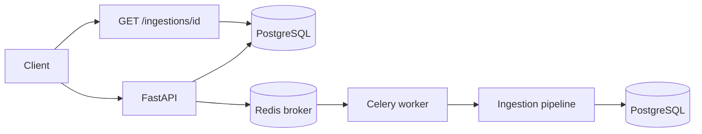
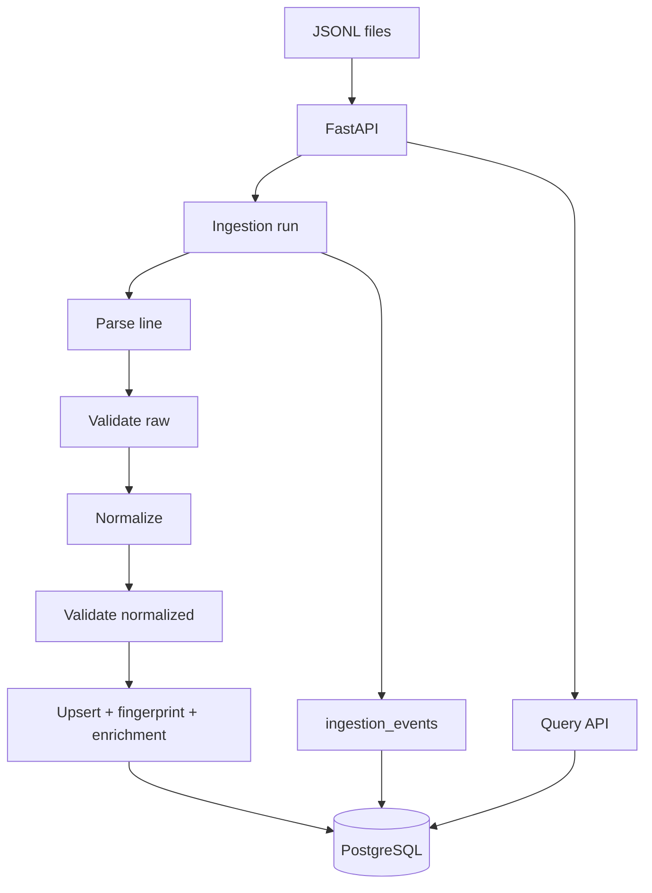
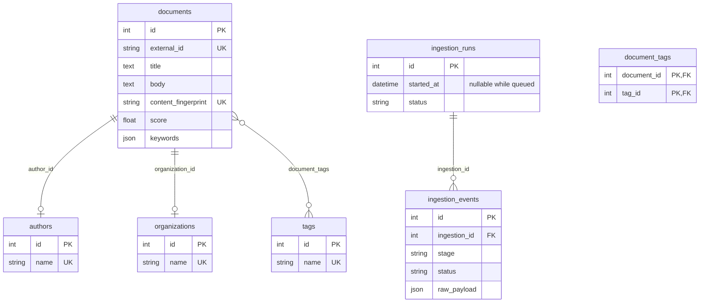

# Document intake (mini data platform)

FastAPI service that ingests messy JSONL document feeds, normalizes fields, enriches records (keywords, classification, score, summary), logs per-row pipeline events, and exposes a small query API backed by PostgreSQL. **Ingestion runs on a Celery worker** with **Redis** as the broker so `POST /ingestions` returns immediately while the file is processed asynchronously.

## How to run

```bash
docker compose up -d
cp .env.example .env
uv sync
uv run alembic upgrade head
uv run uvicorn app.main:app --reload --host 0.0.0.0 --port 8000
```

- `docker compose` starts **PostgreSQL**, **Redis**, and a **Celery worker** (see `docker-compose.yml`). The worker uses the same image as the API and mounts `./input_docs` so `DEFAULT_JSONL_PATH` resolves inside the container.
- Configure `DATABASE_URL` (localhost for uvicorn on the host), `DEFAULT_JSONL_PATH`, and `CELERY_BROKER_URL` / `CELERY_RESULT_BACKEND` in `.env` (see `.env.example`). The worker service overrides `DATABASE_URL` to reach Postgres at hostname `db`.
- Trigger ingestion: `POST /ingestions` (optional query param `file_path`). Response: `{ "run_id": ..., "status": "queued" }`. Poll `GET /ingestions/{run_id}` for progress (`status`: `queued` → `running` → `completed` or `failed`).

**Celery worker on your machine (not Docker)** — Start Redis (and Postgres if needed). Export `DATABASE_URL`, `CELERY_BROKER_URL`, and `CELERY_RESULT_BACKEND` from `.env` (or use a shell that loads `.env`). From the project root after `uv sync`:

```bash
# Uses the project virtualenv via uv (recommended)
uv run celery -A app.celery_app:celery_app worker --loglevel=info
```

To run the same binary from `.venv` explicitly:

```bash
source .venv/bin/activate
celery -A app.celery_app:celery_app worker --loglevel=info
```

Or without activating:

```bash
.venv/bin/celery -A app.celery_app:celery_app worker --loglevel=info
```

**Tests** set `CELERY_TASK_ALWAYS_EAGER=1` so tasks run in-process without Redis.

**Running tests** — from the project root after `uv sync`:

```bash
uv run pytest -q
```

`pytest-cov` is included so the `--no-cov` flag is valid (it disables coverage when something enables it, e.g. a wrapper script or `PYTEST_ADDOPTS`). For day-to-day runs, plain `pytest -q` is enough; use `--no-cov` when your environment injects `--cov` and you want a faster loop.

### Async ingestion (high level)



## Architecture overview

- **FastAPI** HTTP layer: ingestions, document search, stats.
- **PostgreSQL** for durable storage and `UNIQUE(external_id)` idempotency.
- **Ingestion pipeline** (see `app/ingestion/`): parse JSON line → **validate raw** (required `external_id`; `published_at` / `updated_at` must be valid `YYYY-MM-DD` when present) → **normalize** (coerce types, clean strings, tags, language, booleans; invalid DOI/URL dropped to `null`) → **validate normalized** (non-empty `external_id`) → upsert by `external_id` → semantic dedup via `content_fingerprint` (SHA-256 of normalized title + body) → enrichment in the same write path.
- **Processing layer**: keyword frequencies (stopword-stripped), simple title/body classification, composite score, two-sentence summary.

**Ingestion package layout**

| Module | Role |
|--------|------|
| `app/ingestion/parser.py` | `json.loads` per line; `None` on invalid JSON |
| `app/ingestion/validator.py` | Raw record rules + post-normalize checks |
| `app/ingestion/normalizer.py` | Coercion and cleanup into `NormalizedRecord` |
| `app/ingestion/runner.py` | File loop, counters, `ingestion_events` logging |

`app/normalize.py` and `app/validate.py` re-export the canonical implementations for backward-compatible imports.

**Celery**

| Module | Role |
|--------|------|
| `app/celery_app.py` | Celery app, JSON serialization, optional `CELERY_TASK_ALWAYS_EAGER` |
| `app/tasks/ingestion_tasks.py` | `run_ingestion_task(run_id, file_path)` — opens DB session, runs `ingest_file`, commits or marks run `failed` |



## Data model (ERD)



## API

| Method | Path | Description |
|--------|------|-------------|
| `POST` | `/ingestions` | Queue ingestion (`file_path` query optional). Returns `{ "run_id", "status": "queued" }`. |
| `GET` | `/ingestions/{run_id}` | Run summary and event log. |
| `GET` | `/documents` | Paginated list; each item includes `tags`, and optional nested `author` / `organization` (`{ "id", "name" }` or `null`). Filters: `date_from`, `date_to`, `tag`, `organization`, `status`, `search`, `skip`, `limit`. |
| `GET` | `/documents/{id}` | Single document with the same shape (tags plus nested `author` / `organization` when linked). |
| `GET` | `/stats` | Counts, breakdowns, top tags, average score. |
| `GET` | `/health` | Liveness. |

### Pretty-printing JSON responses

API responses are compact JSON. To view them with indentation in the terminal, pipe through **`jq`** or Python’s **`json.tool`**:

```bash
curl -sS "http://localhost:8000/documents?skip=0&limit=5" | jq

curl -sS "http://localhost:8000/stats" | jq
```

Interactive browsing with formatted bodies: open **Swagger UI** at [`http://localhost:8000/docs`](http://localhost:8000/docs) (when the server is running).

### `GET /documents` (curl examples)

The examples below assume the API is at `http://localhost:8000` (see [How to run](#how-to-run)). Each pipes the response through **`jq`** for indented JSON (see [Pretty-printing JSON responses](#pretty-printing-json-responses); you can use `python -m json.tool` instead). Response shape: `{ "items": [...], "total": <int>, "skip": <int>, "limit": <int> }`. Each document object includes `author` and `organization` as `{ "id": <int>, "name": <string> }` when set, or `null` when not linked (top-level `author_id` / `organization_id` are not returned).

Replace placeholder values (`biology`, `Example University`, dates, etc.) with values that exist in your database. `tag`, `organization`, and `status` are **exact** string matches; `search` matches **title or body** (case-insensitive substring). `date_from` / `date_to` filter on **`published_at`** (inclusive range when both are set).

```bash
# Pagination: skip (offset) and limit (1–200, default 20)
curl -sS "http://localhost:8000/documents?skip=0&limit=20" | jq

# published_at >= date_from (ISO YYYY-MM-DD)
curl -sS "http://localhost:8000/documents?date_from=2020-01-01" | jq

# published_at <= date_to
curl -sS "http://localhost:8000/documents?date_to=2024-12-31" | jq

# Date range on published_at
curl -sS "http://localhost:8000/documents?date_from=2020-01-01&date_to=2024-12-31" | jq

# Tag (exact tag name)
curl -sS "http://localhost:8000/documents?tag=biology" | jq

# Organization (exact organization name; encode spaces as %20)
curl -sS "http://localhost:8000/documents?organization=Example%20University" | jq

# Status (exact status string)
curl -sS "http://localhost:8000/documents?status=published" | jq

# Search title or body (case-insensitive)
curl -sS "http://localhost:8000/documents?search=climate%20change" | jq

# All query parameters together
curl -sS "http://localhost:8000/documents?skip=0&limit=50&date_from=2020-01-01&date_to=2025-12-31&tag=biology&organization=Example%20University&status=published&search=health" | jq
```

## Assumptions

- `external_id` is the stable business key; re-ingesting the same id updates the row (idempotent upsert).
- Missing optional fields are allowed; normalization is best-effort (types, tags, language, status, booleans, etc.).
- **Soft cleanup**: malformed DOI strings and non-`http*` URLs are normalized to `null` (the line still ingests). Other bad values typically become `null` or safe defaults (for example empty status → `"unknown"`).
- **Hard validation** (line fails with a validation event): missing or blank `external_id`; non-empty `published_at` or `updated_at` that is not a valid `YYYY-MM-DD` string; empty JSON object `{}` after parse; unparseable JSON lines (logged under parsing).
- Blank lines in the file are skipped and do not increment the run’s line counter.
- Semantic duplicates share the same content fingerprint; the second **distinct** `external_id` is skipped and logged under `deduplication`.

## Stats produced (`GET /stats`)

Aggregates over all stored documents and ingestion-event telemetry. Shape:

| Field | Meaning |
|--------|--------|
| `total_documents` | Row count in `documents`. |
| `by_status` | Counts grouped by `Document.status` (missing status appears as key `"null"`). |
| `by_type` | Counts grouped by `document_type` (missing → `"null"`). |
| `top_tags` | Up to 10 tags by frequency across `document_tags`. |
| `avg_score` | Mean of `Document.score` where score is non-null; `null` if none. |
| `total_ingestion_events` | Rows in `ingestion_events` (lifetime, all runs). |
| `events_by_stage` | Counts of ingestion events by `stage` (`parsing`, `validation`, `deduplication`, `completed`, etc.). |
| `events_by_status` | Counts by event `status` (`success`, `error`, `skipped`). |

Example response (illustrative; numbers depend on your DB):

```json
{
  "total_documents": 1240,
  "by_status": {
    "published": 980,
    "draft": 120,
    "unknown": 140
  },
  "by_type": {
    "article": 800,
    "report": 200,
    "null": 240
  },
  "top_tags": [
    { "name": "biology", "count": 310 },
    { "name": "climate", "count": 205 }
  ],
  "avg_score": 42.7,
  "total_ingestion_events": 5600,
  "events_by_stage": {
    "completed": 1240,
    "parsing": 45,
    "validation": 30,
    "deduplication": 15
  },
  "events_by_status": {
    "success": 1240,
    "error": 75,
    "skipped": 15
  }
}
```

```bash
curl -sS "http://localhost:8000/stats" | jq
```

## Sample execution log

Ingestion emits **structured application logs** (worker / API process) and persists a **per-run summary plus per-line events** queryable via `GET /ingestions/{run_id}`.

### Worker log excerpt (Celery + pipeline)

After `POST /ingestions`, the worker logs task lifecycle and the runner logs start/finish with counters. Example lines (timestamps and IDs will differ):

```text
Celery ingestion task started run_id=3 path=/app/input_docs/documents_1.jsonl
Starting ingestion run_id=3 path=/app/input_docs/documents_1.jsonl
Finished ingestion run_id=3 total=4000 success=3950 errors=35 skipped=15
Celery ingestion task completed run_id=3 total=4000 success=3950 errors=35 skipped=15
```

- **`total`** — non-blank JSONL lines read (see [Assumptions](#assumptions) for blank lines).
- **`success`** — lines upserted successfully.
- **`errors`** — parse failures, empty `{}`, or validation failures (`stage` `parsing` or `validation` in events).
- **`skipped`** — semantic duplicates (`stage` `deduplication`).

### Run summary JSON (`GET /ingestions/{run_id}`)

Poll until `status` is `completed` or `failed`. Example body after a successful run (truncated `events` for readability; real responses include one event per processed line where logging applies):

```bash
curl -sS "http://localhost:8000/ingestions/3" | jq
```

```json
{
  "ingestion_id": 3,
  "started_at": "2026-04-17T12:01:02.123456+00:00",
  "finished_at": "2026-04-17T12:03:44.987654+00:00",
  "total_records": 4000,
  "success_count": 3950,
  "error_count": 35,
  "skipped_count": 15,
  "status": "completed",
  "events": [
    {
      "external_id": "doc-00001",
      "status": "success",
      "message": null,
      "stage": "completed"
    },
    {
      "external_id": null,
      "status": "error",
      "message": "invalid JSON or empty payload",
      "stage": "parsing"
    },
    {
      "external_id": "doc-00442",
      "status": "skipped",
      "message": "semantic duplicate of document doc-00102",
      "stage": "deduplication"
    }
  ]
}
```

## What you would improve with more time

- **Full-text search** — PostgreSQL `tsvector` / GIN instead of `ILIKE` on title/body for large corpora.
- **Authentication and rate limits** on `/ingestions` and bulk export endpoints.
- **Explicit enrichment events** — optional `ingestion_events` rows for keyword/classification/summary stages (today enrichment runs in-process; only dedup/validation/parsing surface as stages in the event list).
- **Batch or streaming ingestion** — multipart uploads, S3/GCS sources, checkpointing for huge files.
- **Observability** — OpenTelemetry traces, structured JSON logs to a collector, metrics (Prometheus) for ingest duration and queue depth.
- **Load and contract tests** — performance budgets against sample multi-GB JSONL; OpenAPI response examples generated from fixtures.
