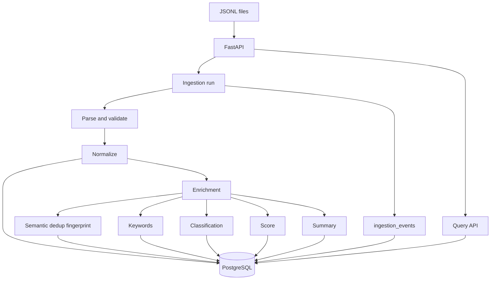
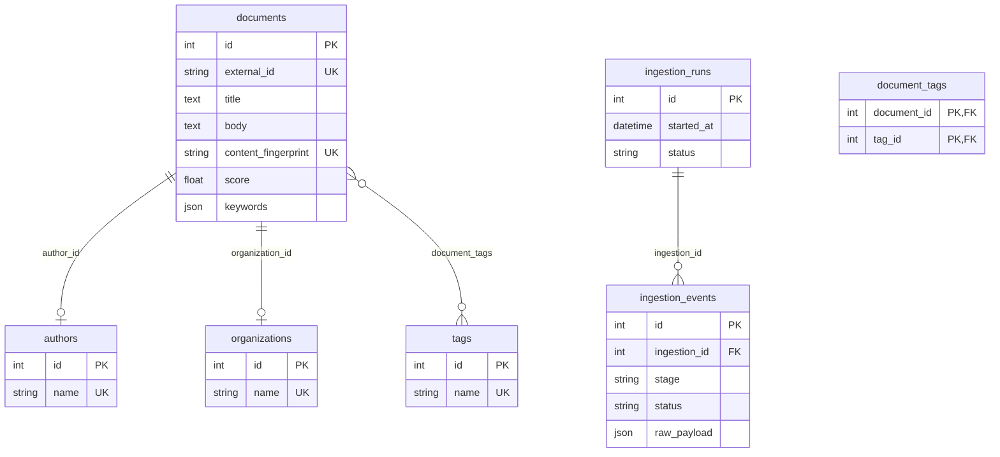

# Document intake (mini data platform)

FastAPI service that ingests messy JSONL document feeds, normalizes fields, enriches records (keywords, classification, score, summary), logs per-row pipeline events, and exposes a small query API backed by PostgreSQL.

## How to run

```bash
docker compose up -d
cp .env.example .env
uv sync
uv run alembic upgrade head
uv run uvicorn app.main:app --reload --host 0.0.0.0 --port 8000
```

- Optional: set `DATABASE_URL` and `DEFAULT_JSONL_PATH` in `.env` (see `.env.example`).
- Trigger ingestion: `POST /ingestions` (optional query param `file_path` to override the default JSONL path).

## Architecture overview

- **FastAPI** HTTP layer: ingestions, document search, stats.
- **PostgreSQL** for durable storage and `UNIQUE(external_id)` idempotency.
- **Ingestion pipeline**: parse line → normalize → validate (DOI, URL) → upsert by `external_id` → semantic dedup via `content_fingerprint` (SHA-256 of normalized title + body) → enrichment.
- **Processing layer**: keyword frequencies (stopword-stripped), simple title/body classification, composite score, two-sentence summary.



## Data model (ERD)



## API

| Method | Path | Description |
|--------|------|-------------|
| `POST` | `/ingestions` | Queue ingestion (`file_path` query optional). Returns `{ "run_id": ... }`. |
| `GET` | `/ingestions/{run_id}` | Run summary and event log. |
| `GET` | `/documents` | Paginated list; filters: `date_from`, `date_to`, `tag`, `organization`, `status`, `search`, `skip`, `limit`. |
| `GET` | `/documents/{id}` | Single document (includes tag names). |
| `GET` | `/stats` | Counts, breakdowns, top tags, average score. |
| `GET` | `/health` | Liveness. |

## Assumptions

- `external_id` is the stable business key; re-ingesting the same id updates the row (idempotent upsert).
- Missing fields are allowed; normalization is best-effort (types, tags, language, status, booleans).
- Invalid DOI or URL patterns fail validation for that line; empty `{}` lines fail as “empty record”.
- Semantic duplicates share the same content fingerprint; the second **distinct** `external_id` is skipped and logged under `deduplication`.
