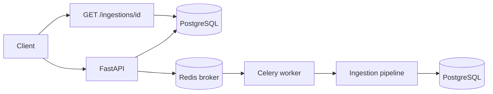
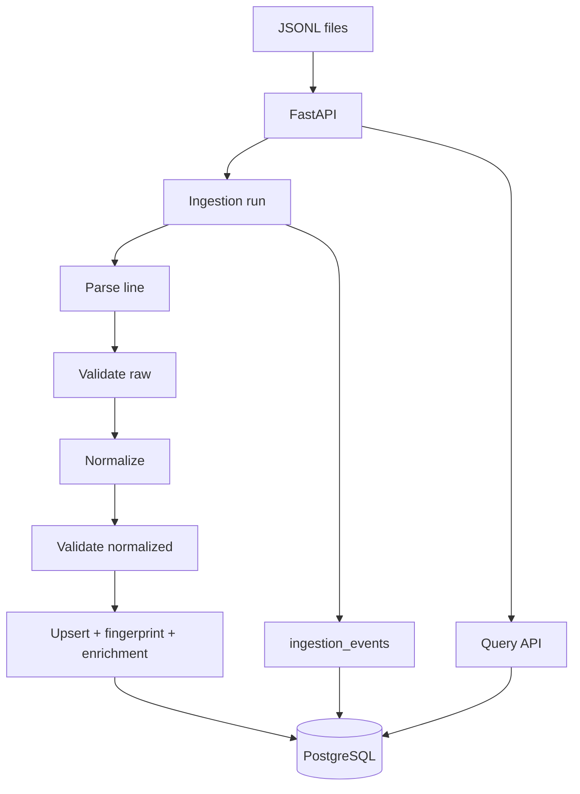
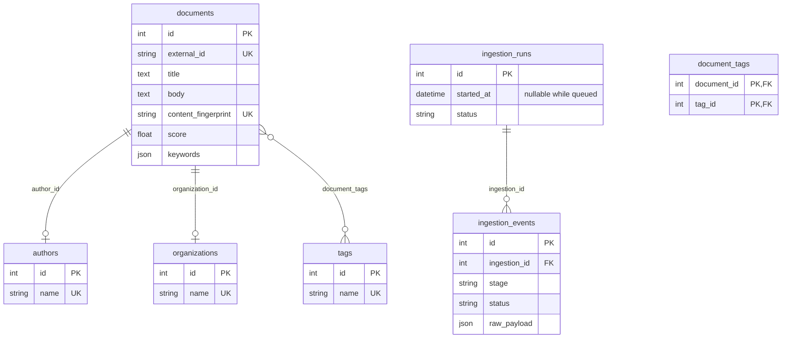

# Document intake (mini data platform)

FastAPI service that ingests messy JSONL document feeds, normalizes fields, enriches records (keywords, classification, score, summary), logs per-row pipeline events, and exposes a small query API backed by PostgreSQL. **Ingestion runs on a Celery worker** with **Redis** as the broker so `POST /ingestions` returns immediately while the file is processed asynchronously.

## How to run

```bash
docker compose up -d
cp .env.example .env
uv sync
uv run alembic upgrade head
uv run uvicorn app.main:app --reload --host 0.0.0.0 --port 8000
```

- `docker compose` starts **PostgreSQL**, **Redis**, and a **Celery worker** (see `docker-compose.yml`). The worker uses the same image as the API and mounts `./input_docs` so `DEFAULT_JSONL_PATH` resolves inside the container.
- Configure `DATABASE_URL` (localhost for uvicorn on the host), `DEFAULT_JSONL_PATH`, and `CELERY_BROKER_URL` / `CELERY_RESULT_BACKEND` in `.env` (see `.env.example`). The worker service overrides `DATABASE_URL` to reach Postgres at hostname `db`.
- Trigger ingestion: `POST /ingestions` (optional query param `file_path`). Response: `{ "run_id": ..., "status": "queued" }`. Poll `GET /ingestions/{run_id}` for progress (`status`: `queued` → `running` → `completed` or `failed`).

**Worker only (manual):**

```bash
celery -A app.celery_app:celery_app worker --loglevel=info
```

**Tests** set `CELERY_TASK_ALWAYS_EAGER=1` so tasks run in-process without Redis.

### Async ingestion (high level)



## Architecture overview

- **FastAPI** HTTP layer: ingestions, document search, stats.
- **PostgreSQL** for durable storage and `UNIQUE(external_id)` idempotency.
- **Ingestion pipeline** (see `app/ingestion/`): parse JSON line → **validate raw** (required `external_id`; `published_at` / `updated_at` must be valid `YYYY-MM-DD` when present) → **normalize** (coerce types, clean strings, tags, language, booleans; invalid DOI/URL dropped to `null`) → **validate normalized** (non-empty `external_id`) → upsert by `external_id` → semantic dedup via `content_fingerprint` (SHA-256 of normalized title + body) → enrichment in the same write path.
- **Processing layer**: keyword frequencies (stopword-stripped), simple title/body classification, composite score, two-sentence summary.

**Ingestion package layout**

| Module | Role |
|--------|------|
| `app/ingestion/parser.py` | `json.loads` per line; `None` on invalid JSON |
| `app/ingestion/validator.py` | Raw record rules + post-normalize checks |
| `app/ingestion/normalizer.py` | Coercion and cleanup into `NormalizedRecord` |
| `app/ingestion/runner.py` | File loop, counters, `ingestion_events` logging |

`app/normalize.py` and `app/validate.py` re-export the canonical implementations for backward-compatible imports.

**Celery**

| Module | Role |
|--------|------|
| `app/celery_app.py` | Celery app, JSON serialization, optional `CELERY_TASK_ALWAYS_EAGER` |
| `app/tasks/ingestion_tasks.py` | `run_ingestion_task(run_id, file_path)` — opens DB session, runs `ingest_file`, commits or marks run `failed` |



## Data model (ERD)



## API

| Method | Path | Description |
|--------|------|-------------|
| `POST` | `/ingestions` | Queue ingestion (`file_path` query optional). Returns `{ "run_id", "status": "queued" }`. |
| `GET` | `/ingestions/{run_id}` | Run summary and event log. |
| `GET` | `/documents` | Paginated list; filters: `date_from`, `date_to`, `tag`, `organization`, `status`, `search`, `skip`, `limit`. |
| `GET` | `/documents/{id}` | Single document (includes tag names). |
| `GET` | `/stats` | Counts, breakdowns, top tags, average score. |
| `GET` | `/health` | Liveness. |

## Assumptions

- `external_id` is the stable business key; re-ingesting the same id updates the row (idempotent upsert).
- Missing optional fields are allowed; normalization is best-effort (types, tags, language, status, booleans, etc.).
- **Soft cleanup**: malformed DOI strings and non-`http*` URLs are normalized to `null` (the line still ingests). Other bad values typically become `null` or safe defaults (for example empty status → `"unknown"`).
- **Hard validation** (line fails with a validation event): missing or blank `external_id`; non-empty `published_at` or `updated_at` that is not a valid `YYYY-MM-DD` string; empty JSON object `{}` after parse; unparseable JSON lines (logged under parsing).
- Blank lines in the file are skipped and do not increment the run’s line counter.
- Semantic duplicates share the same content fingerprint; the second **distinct** `external_id` is skipped and logged under `deduplication`.
